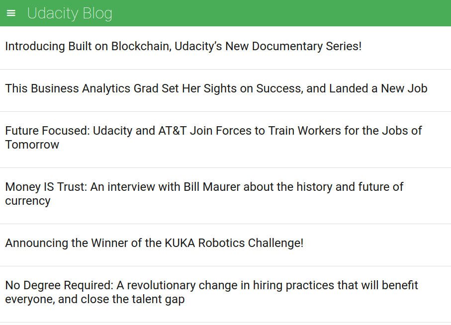

# Feed Reader Testing
--------

This repo serves as a home for the 'Feed Reader Testing' project in the Udacity [Frontend Web Development](https://www.udacity.com/course/front-end-web-developer-nanodegree--nd001) Nanodegree.

This project is an exercise for writing tests against a pre-existing application, and a study of test-driven development.

The Feed Reader is a web-based application that pulls in the [RSS feeds](https://en.wikipedia.org/wiki/RSS) from the Udacity blog, CSS Tricks, HTML5 Rocks, and Linear Digressions. It uses the Google Feed Reader API and stores RSS feeds as a JSON object. The unit tests are written with [Jasmine](http://jasmine.github.io/), a JavaScript behavioral test suite developed by [Pivotal Labs](https://pivotal.io/open-source).

The written tests help to analyze multiple aspects of the Feed Reader such as the logic, event handling and DOM manipulation, and to test whether introducing new code will break a feature without having to manually test the application.

Project Setup Instructions
--------

**To setup this project on a local machine:**

:memo: This project uses the Jasmine testing framework as a standalone. It doesn't use any build tools, et al. And you can view which tests are passing/failing right in the web browser. As such it's pretty straightforward to get up and running. The following dependencies are used:

- [ ] Git version control - [get started with Git](https://git-scm.com/book/en/v2/Getting-Started-Installing-Git)
- [ ] Jasmine - [get started with Jasmine](https://jasmine.github.io/pages/getting_started.html)
- [ ] Your favorite local server

:heavy_check_mark: Be sure to follow the dependency setup instructions specific to your machine's operating system. Then, fork, download or clone this project [from Github](https://github.com/cynsdaemon/feed-reader-testing/) and open it in your favorite web browser or run a local server.

**To view or edit tests:** Navigate to the [Jasmine tests](/jasmine/spec/feedreader.js) file. The file lives in the repository:

>```./jasmine/spec/feedreader.js```

### Screenshot of the Feed Reader app once it's up and running:


Resources
--------

This project uses the following style guides and repositories:

- The Feed Reader application, grading rubric, and style guides via [Udacity](https://github.com/udacity/frontend-nanodegree-feedreader)'s repository

Contributions and Feedback
--------

For feedback and suggestions feel free to open an [issue on Github](https://github.com/cynsdaemon/feed-reader-testing/issues) for this project.

License
--------

This project is build with love :heart: coffee :coffee: and an awesome playlist :musical_note:. Copyright &copy; 2018 [Cynthia L. Wright](https://www.cynthialanel.com).

